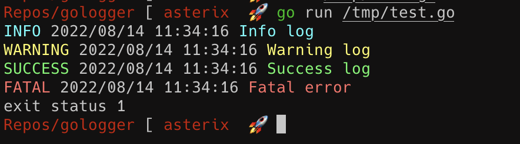

<p align="center" >
  
  <h3 align="center">go-logger</h3>
  <p align="center">Simple package for logging in golang</p>
</p>

<p align="center" >
  
  
  
</p>

---

# Simple usage

```go
package main

import (
 "fmt"
 "log"
 "os"

 "github.com/nanih98/gologger"
)

func main() {
 log := gologger.New(os.Stdout, "", log.Ldate|log.Ltime)
 log.Info("Info log")
 log.Warn("Warning log")
 log.Success("Success log")
 log.Fatal(fmt.Errorf("Fatal error"))
 //....
}
```
# Example
  

# About

This library is a simple implementation of the native library log. Is almost the same but with colored output.

It is not for production environments, just to learn how to create your own library :)

For production environments or real apps, use the following libraries:

* Zap
* Zerolog
* Logrus (my favourite)

